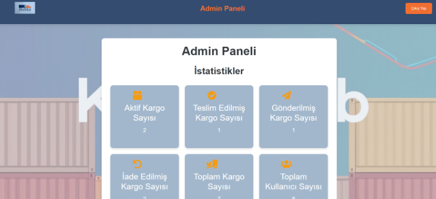
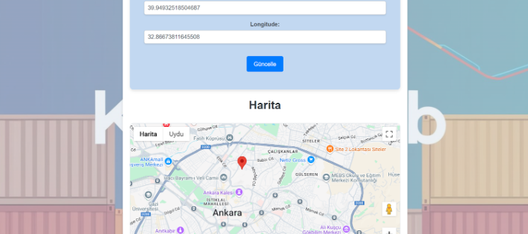
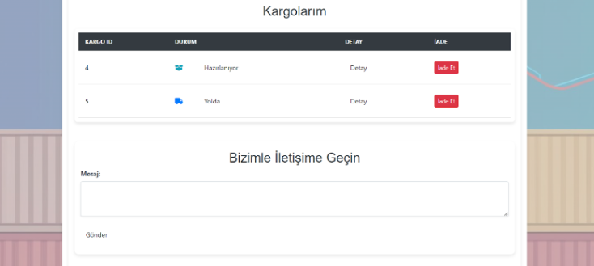
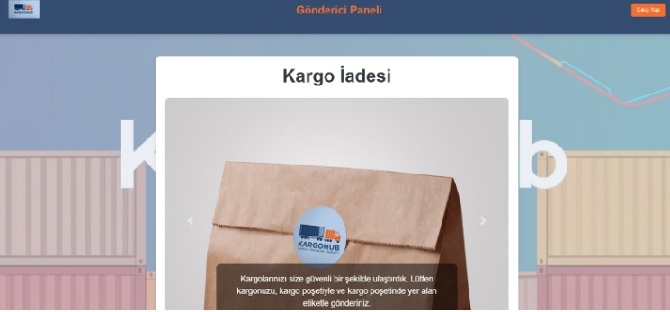

# 📦 Akıllı Kargo Takip Sistemi (Graduation Project)

Bu proje, Fırat Üniversitesi Yapay Zeka ve Veri Mühendisliği Bölümü **Bitirme Projesi** (YMH414) kapsamında geliştirilmiştir. Gönderici, alıcı ve yönetici arasındaki kargo sürecini şeffaf, hızlı ve güvenilir hale getirmeyi amaçlayan kapsamlı bir web platformudur.

## 🎯 Projenin Temel Özellikleri

Raporda detaylandırılan özellikler başarıyla entegre edilmiştir:

* **📍 Google Maps Entegrasyonu:** Kargonun anlık konumu ve teslimat rotası harita üzerinden takip edilebilir.
* **💬 Gerçek Zamanlı Mesajlaşma:** Gönderici ve alıcı, sistem üzerinden doğrudan iletişim kurabilir.
* **📊 Gelişmiş Admin Paneli:** Yöneticiler için kargo yoğunluğu, şikayet oranları ve sistem istatistiklerini gösteren grafiksel dashboard.
* **⚠️ Şikayet & Talep Yönetimi:** Kullanıcı şikayetlerinin toplandığı ve yönetildiği modül.
* **🔄 İade Süreçleri:** Kullanıcı dostu arayüz ile kolay ürün iade talebi oluşturma.

## 📸 Proje Ekran Görüntüleri

| Admin Dashboard | Harita Takibi |
| :---: | :---: |
|  |  |
| *Detaylı istatistikler ve yönetim araçları* | *Google Maps API ile konum takibi* |

| Mesajlaşma Sistemi | İade Ekranı |
| :---: | :---: |
|  |  |

## 🛠️ Kullanılan Teknolojiler ve Zorluklar

Bu projenin geliştirilme sürecinde karşılaşılan teknik zorluklar ve çözümler:

* **Google Maps API:** Koordinat işlemleri ve harita entegrasyonu optimize edilerek hata payı minimize edildi.
* **İletişim Altyapısı:** Kullanıcılar arası mesajlaşma için veritabanı tabanlı bir iletişim protokolü tasarlandı.
* **Veri Güvenliği:** Üye bilgileri ve kargo verileri için güvenli güncelleme mekanizmaları kuruldu.

## 📄 Proje Raporu
Detaylı teknik rapor ve analizler için [Proje Raporu](docs/Proje_Raporu.pdf) dosyasını inceleyebilirsiniz.

---
**Geliştirici:** Zehra Gündüz
**Danışman:** Dr. Öğr. Üyesi Mahmut KAYA
